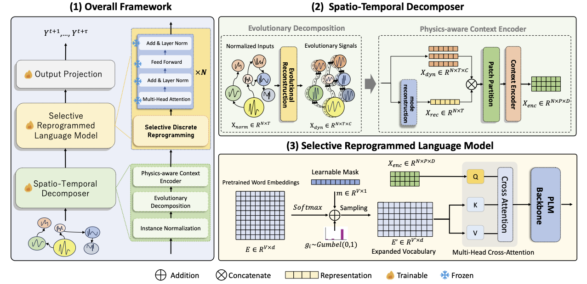

<div align="center">
  <!-- <h1><b> Time-LLM </b></h1> -->
  <!-- <h2><b> Time-LLM </b></h2> -->
  <h2><b> (IJCAI'25) RePST: Language Model Empowered Spatio-Temporal Forecasting via Semantic-Oriented Reprogramming </b></h2>
</div>


---
>
> 🙋 Please let us know if you find out a mistake or have any suggestions!
> 🐝 The full version of this paper can be accessed at https://arxiv.org/abs/2408.14505.
> 🌟 If you find this resource helpful, please consider to star this repository and cite our research:

```
@inproceedings{wang2025repst,
  title={RePST: Language Model Empowered Spatio-Temporal Forecasting via Semantic-Oriented Reprogramming},
  author={Wang, Hao and Han, Jindong and Fan, Wei and Sun, Leilei and Liu, Hao},
  booktitle={Proceedings of the 34th International Joint Conference on Artificial Intelligence},
  year={2025}
}
```


## Introduction
This repository contains the implementation of REPST, a framework for spatio-temporal forecasting that leverages the reasoning and generalization capabilities of Pre-trained Language Models (PLMs). REPST utilizes a semantic-aware spatio-temporal decomposer and selective discrete reprogramming to enable PLMs to handle complex spatio-temporal data, especially in data-scarce environments.

<p align="center">

</p>

- RePST comprises two key components: (1) a dynamic mode decomposition approach that disentangles spatially correlated time series into interpretable components, and (2) an expanded spatio-temporal vocabulary that helps PLMs better understand the dynamics of complex spatio-temporal systems, to guide PLM reasoning.

<p align="center">

</p>

## Requirements
Use python 3.11 from MiniConda

- torch==2.0.1
- accelerate==0.28.0
- einops==0.6.0
- matplotlib==3.7.0
- numpy==1.24.4
- pandas==2.1.4
- scikit_learn==1.3.2
- scipy==1.11.4
- tqdm==4.66.1
- transformers==4.36.2


To install all dependencies:
```
pip install -r requirements.txt
```

## Datasets
# Pending
You can access the well pre-processed datasets from [[Google Drive]](https://drive.google.com/), then place the downloaded contents under `./dataset`


## Detailed usage

Please refer to ```run.py``` for the detailed description of each hyperparameter.


## Acknowledgement
Our baseline model implementation adapts [BasicTS](https://github.com/GestaltCogTeam/BasicTS) as the code base and have extensively modified it to our purposes. We thank the authors for sharing their implementations and related resources.
